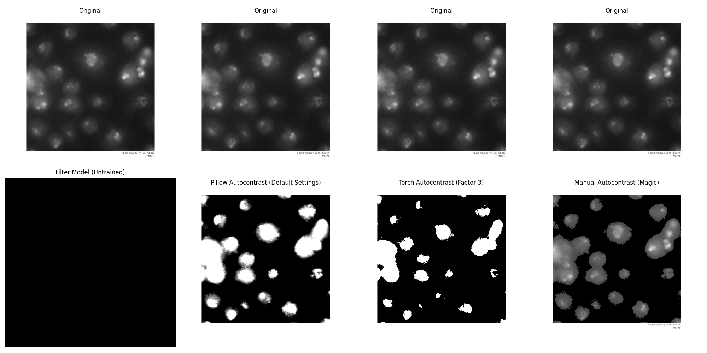

# AutoContrast Methods for Image Processing

This repository explores different methods for applying autocontrast to grayscale images. Three main approaches are implemented:

1. **Simple Filter Model** - A neural network-based filter that learns a transformation.
2. **Library-Based Methods** - Using Pillow and Torch to apply autocontrast.
3. **Manual Implementation** - A custom algorithm that applies autocontrast using histogram-based scaling.

This is just for educational purposes and your use case may require a different approach.

## Usage

### Installation

Ensure you have the required dependencies installed:

```bash
pip install torch torchvision pillow matplotlib
```

### Running the Script

```bash
python main.py
```

### Methods Implemented

- **SimpleFilterModel**: Uses a learnable convolutional filter.
- **AutoContraster**: Applies autocontrast using PIL and Torch.
- **ManualContraster**: Implements a custom autocontrast logic based on histogram scaling.

## Results

The script generates and saves a comparison of the different methods.



## Explanation

- The manual method assumes the brightest pixels represent cells.
- The lowest 45% of pixel intensities are clamped to zero to enhance contrast.
- This ensures that the cells remain visible while the background is suppressed.
- Empirically, it seems like this method works as well as PIL, but has the added benefit of not flattening the gradients that could be extracted from inside the cell borders.
